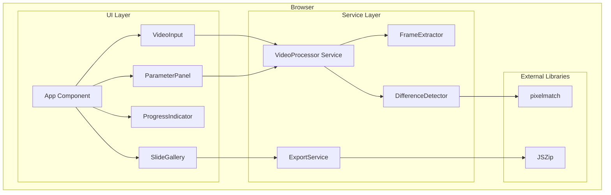
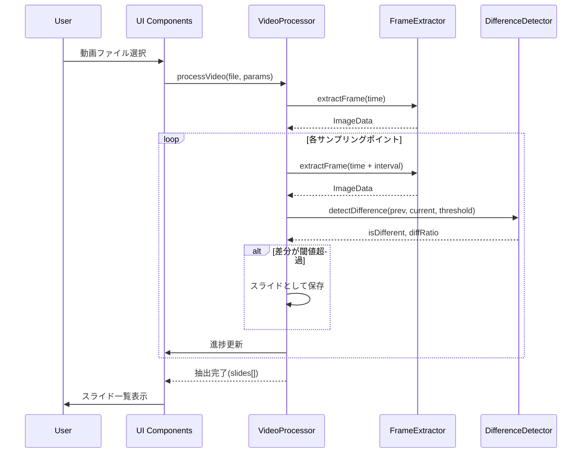
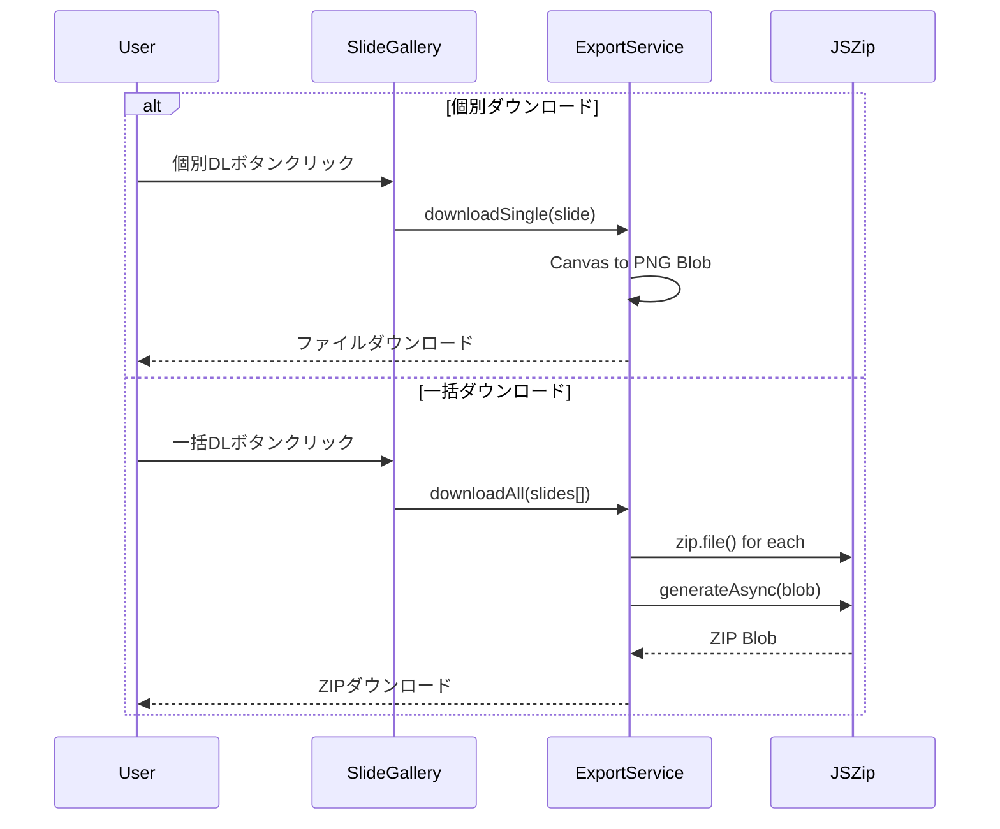
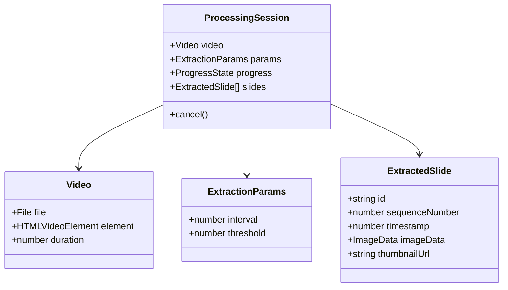

# Design Document

## Overview

**Purpose**: 本機能は、公演動画からスライド画像を自動抽出する機能をユーザーに提供する。

**Users**: プレゼンテーション資料を動画から回収したいユーザーが、手動でスクリーンショットを取る代わりに自動抽出を利用する。

**Impact**: 完全新規開発（greenfield）。既存システムへの影響なし。

### Goals
- ローカル動画ファイルをブラウザ内で読み込み、サーバー送信なしで処理
- フレーム間差分検出によるスライド切り替え自動検出
- 検出スライドの個別/一括ダウンロード機能
- 判定頻度・閾値のカスタマイズ機能

### Non-Goals
- 動画編集機能
- クラウドストレージ連携
- 複数動画の同時処理
- モバイルデバイス最適化（デスクトップブラウザ優先）

## Architecture

### Architecture Pattern & Boundary Map



**Architecture Integration**:
- **Selected pattern**: Feature-based + Service Layer。UIコンポーネントと処理ロジックを分離。
- **Domain boundaries**: UI Layer（表示・入力）/ Service Layer（ビジネスロジック）/ External Libraries（外部依存）
- **New components rationale**: 各コンポーネントは単一責務を持ち、テスタブルな設計
- **Steering compliance**: N/A（steeringディレクトリ未設定）

### Technology Stack

| Layer | Choice / Version | Role in Feature | Notes |
|-------|------------------|-----------------|-------|
| Frontend | React 18.x + TypeScript 5.x | UI構築・状態管理 | 厳格な型チェック有効化 |
| Build Tool | Vite 5.x | 開発サーバー・ビルド | ESモジュールベース高速起動 |
| Frame Extraction | Canvas API (native) | 動画フレーム取得 | 追加依存なし |
| Difference Detection | pixelmatch ^5.3.0 | ピクセル差分計算 | 軽量・高速 |
| ZIP Generation | jszip ^3.10.1 | 一括ダウンロード | 安定・成熟 |
| Testing | Vitest + Testing Library | ユニット・統合テスト | Vite最適化 |

## System Flows

### スライド抽出フロー



**Key Decisions**:
- サンプリングはsetTimeout/requestAnimationFrameでメインスレッドをブロックしない
- 前フレームのImageDataは比較完了後に即座に解放

### ダウンロードフロー



## Requirements Traceability

| Requirement | Summary | Components | Interfaces | Flows |
|-------------|---------|------------|------------|-------|
| 1.1 | 動画読み込み・プレビュー | VideoInput | VideoInputProps | - |
| 1.2 | クライアントサイド完結 | 全コンポーネント | - | - |
| 1.3 | 非対応形式エラー | VideoInput | onError callback | - |
| 1.4 | MP4/WebM/OGGサポート | VideoInput | SUPPORTED_FORMATS | - |
| 2.1 | 指定頻度でサンプリング | VideoProcessor, FrameExtractor | ExtractorService | 抽出フロー |
| 2.2 | 差分閾値判定 | DifferenceDetector | DifferenceResult | 抽出フロー |
| 2.3 | デフォルト1秒間隔 | ParameterPanel | DEFAULT_INTERVAL | - |
| 2.4 | ピクセル差分計算 | DifferenceDetector | pixelmatch API | 抽出フロー |
| 3.1, 3.2 | パラメータ変更 | ParameterPanel | ExtractionParams | - |
| 3.3, 3.4 | 入力フィールド提供 | ParameterPanel | ParameterPanelProps | - |
| 3.5 | デフォルト値表示 | ParameterPanel | DEFAULT_PARAMS | - |
| 4.1 | サムネイル一覧 | SlideGallery | SlideGalleryProps | - |
| 4.2 | 個別ダウンロード | ExportService | downloadSingle() | DLフロー |
| 4.3 | 一括ZIP | ExportService | downloadAll() | DLフロー |
| 4.4 | シーケンス番号付与 | ExportService | generateFilename() | - |
| 5.1 | 進捗バー | ProgressIndicator | ProgressState | 抽出フロー |
| 5.2 | フレーム位置表示 | ProgressIndicator | currentTime | 抽出フロー |
| 5.3 | スライド数表示 | SlideGallery | slides.length | - |
| 5.4 | エラー表示・中断 | App | ProcessingError | - |
| 6.1 | SPA | App | - | - |
| 6.2 | レスポンシブ | 全UIコンポーネント | CSS | - |
| 6.3 | 操作手順明示 | App | - | - |
| 6.4 | キャンセル機能 | VideoProcessor | cancel() | - |

## Components and Interfaces

| Component | Domain/Layer | Intent | Req Coverage | Key Dependencies | Contracts |
|-----------|--------------|--------|--------------|------------------|-----------|
| App | UI | アプリケーションルート・状態管理 | 6.1, 6.3, 5.4 | 全UIコンポーネント (P0) | State |
| VideoInput | UI | 動画ファイル選択・プレビュー | 1.1, 1.3, 1.4 | HTMLVideoElement (P0) | Service |
| ParameterPanel | UI | パラメータ入力UI | 3.1-3.5 | - | Service |
| ProgressIndicator | UI | 進捗表示 | 5.1, 5.2 | - | - |
| SlideGallery | UI | スライド一覧・DLボタン | 4.1, 5.3 | ExportService (P0) | Service |
| VideoProcessor | Service | 抽出処理オーケストレーション | 2.1, 6.4 | FrameExtractor (P0), DifferenceDetector (P0) | Service |
| FrameExtractor | Service | Canvas経由フレーム取得 | 2.1, 2.4 | Canvas API (P0) | Service |
| DifferenceDetector | Service | ピクセル差分判定 | 2.2, 2.4 | pixelmatch (P0) | Service |
| ExportService | Service | 画像/ZIPエクスポート | 4.2, 4.3, 4.4 | JSZip (P0) | Service |

### UI Layer

#### VideoInput

| Field | Detail |
|-------|--------|
| Intent | 動画ファイルの選択とプレビュー表示を担当 |
| Requirements | 1.1, 1.3, 1.4 |

**Responsibilities & Constraints**
- ファイル入力要素とvideo要素の管理
- サポート形式のバリデーション（MP4, WebM, OGG）
- Object URLの生成と解放

**Dependencies**
- Inbound: App — ファイル選択イベント受信 (P0)
- External: HTMLVideoElement — 動画再生 (P0)

**Contracts**: Service [x]

##### Service Interface
```typescript
interface VideoInputProps {
  onVideoLoad: (video: HTMLVideoElement, file: File) => void;
  onError: (error: VideoLoadError) => void;
  disabled?: boolean;
}

type VideoLoadError = {
  type: 'UNSUPPORTED_FORMAT' | 'LOAD_FAILED';
  message: string;
};

const SUPPORTED_FORMATS = ['video/mp4', 'video/webm', 'video/ogg'] as const;
```

#### ParameterPanel

| Field | Detail |
|-------|--------|
| Intent | 抽出パラメータの入力UIを提供 |
| Requirements | 3.1, 3.2, 3.3, 3.4, 3.5 |

**Responsibilities & Constraints**
- 判定頻度（秒）と閾値（%）の入力フィールド
- バリデーション（正の数値、範囲チェック）
- デフォルト値の表示

**Dependencies**
- Inbound: App — パラメータ変更通知 (P0)

**Contracts**: Service [x]

##### Service Interface
```typescript
interface ParameterPanelProps {
  params: ExtractionParams;
  onChange: (params: ExtractionParams) => void;
  disabled?: boolean;
}

interface ExtractionParams {
  /** サンプリング間隔（秒） */
  interval: number;
  /** 差分閾値（0-100%） */
  threshold: number;
}

const DEFAULT_PARAMS: ExtractionParams = {
  interval: 1.0,
  threshold: 10,
};
```

#### ProgressIndicator

| Field | Detail |
|-------|--------|
| Intent | 抽出処理の進捗状況を表示 |
| Requirements | 5.1, 5.2 |

**Responsibilities & Constraints**
- 進捗バーの描画
- 現在処理位置の表示
- 処理中/完了/エラー状態の視覚的区別

**Contracts**: (props only)

```typescript
interface ProgressIndicatorProps {
  state: ProgressState;
}

interface ProgressState {
  status: 'idle' | 'processing' | 'completed' | 'error';
  currentTime: number;
  totalDuration: number;
  slidesFound: number;
  errorMessage?: string;
}
```

#### SlideGallery

| Field | Detail |
|-------|--------|
| Intent | 抽出されたスライドのサムネイル一覧とダウンロード操作を提供 |
| Requirements | 4.1, 5.3 |

**Responsibilities & Constraints**
- スライドサムネイルのグリッド表示
- 個別/一括ダウンロードボタン
- スライド数の表示

**Dependencies**
- Inbound: App — slides配列 (P0)
- Outbound: ExportService — ダウンロード実行 (P0)

**Contracts**: Service [x]

##### Service Interface
```typescript
interface SlideGalleryProps {
  slides: ExtractedSlide[];
  onDownloadSingle: (slide: ExtractedSlide) => void;
  onDownloadAll: () => void;
}

interface ExtractedSlide {
  id: string;
  sequenceNumber: number;
  timestamp: number;
  imageData: ImageData;
  thumbnailUrl: string;
}
```

### Service Layer

#### VideoProcessor

| Field | Detail |
|-------|--------|
| Intent | スライド抽出処理全体のオーケストレーション |
| Requirements | 2.1, 6.4 |

**Responsibilities & Constraints**
- 動画のシーク制御
- フレーム抽出・比較のループ制御
- 進捗通知
- キャンセル処理

**Dependencies**
- Inbound: App — 処理開始/キャンセル (P0)
- Outbound: FrameExtractor — フレーム取得 (P0)
- Outbound: DifferenceDetector — 差分判定 (P0)

**Contracts**: Service [x]

##### Service Interface
```typescript
interface VideoProcessorService {
  processVideo(
    video: HTMLVideoElement,
    params: ExtractionParams,
    onProgress: (state: ProgressState) => void
  ): Promise<ProcessingResult>;

  cancel(): void;
}

type ProcessingResult =
  | { success: true; slides: ExtractedSlide[] }
  | { success: false; error: ProcessingError };

type ProcessingError = {
  type: 'CANCELLED' | 'EXTRACTION_FAILED' | 'UNKNOWN';
  message: string;
};
```

**Implementation Notes**
- Integration: requestAnimationFrame/setTimeoutでメインスレッドブロック回避
- Validation: パラメータ範囲チェック（interval > 0, 0 <= threshold <= 100）
- Risks: 大容量動画でのメモリ使用量。ImageDataは比較後即解放。

#### FrameExtractor

| Field | Detail |
|-------|--------|
| Intent | Canvas APIを使用した動画フレームの画像データ取得 |
| Requirements | 2.1, 2.4 |

**Responsibilities & Constraints**
- 指定時刻へのシーク
- Canvas描画とImageData取得
- Canvas要素の再利用（メモリ効率）

**Dependencies**
- External: Canvas 2D API (P0)

**Contracts**: Service [x]

##### Service Interface
```typescript
interface FrameExtractorService {
  extractFrame(video: HTMLVideoElement, time: number): Promise<ImageData>;
  dispose(): void;
}
```

**Implementation Notes**
- Integration: video.currentTime設定 → seeked イベント待機 → drawImage → getImageData
- Risks: 動画のシーク精度はブラウザ/コーデックに依存

#### DifferenceDetector

| Field | Detail |
|-------|--------|
| Intent | 2つのフレーム間のピクセル差分を検出 |
| Requirements | 2.2, 2.4 |

**Responsibilities & Constraints**
- pixelmatchライブラリのラッパー
- 差分率の計算（差異ピクセル数 / 総ピクセル数）
- 閾値との比較

**Dependencies**
- External: pixelmatch (P0)

**Contracts**: Service [x]

##### Service Interface
```typescript
interface DifferenceDetectorService {
  detectDifference(
    frame1: ImageData,
    frame2: ImageData,
    threshold: number
  ): DifferenceResult;
}

interface DifferenceResult {
  isDifferent: boolean;
  diffRatio: number;
  diffPixelCount: number;
}
```

**Implementation Notes**
- Integration: pixelmatch(img1.data, img2.data, null, width, height, { threshold: 0.1 })
- Validation: 両フレームの寸法一致チェック

#### ExportService

| Field | Detail |
|-------|--------|
| Intent | 画像の個別/一括エクスポート機能を提供 |
| Requirements | 4.2, 4.3, 4.4 |

**Responsibilities & Constraints**
- ImageDataからPNG Blobへの変換
- ファイル名生成（シーケンス番号付き）
- JSZipによるZIPアーカイブ生成

**Dependencies**
- External: JSZip (P0)

**Contracts**: Service [x]

##### Service Interface
```typescript
interface ExportServiceInterface {
  downloadSingle(slide: ExtractedSlide): Promise<void>;
  downloadAll(slides: ExtractedSlide[]): Promise<void>;
}
```

**Implementation Notes**
- Integration: canvas.toBlob('image/png') → JSZip.file() → generateAsync({type: 'blob'})
- Validation: slides配列が空の場合は早期リターン

## Data Models

### Domain Model



**Business Rules & Invariants**:
- interval > 0（正の秒数）
- 0 <= threshold <= 100（パーセンテージ）
- sequenceNumber は 1 から連番
- timestamp は 0 <= timestamp <= video.duration

### Logical Data Model

**Application State Structure**:
```typescript
interface AppState {
  video: {
    file: File | null;
    element: HTMLVideoElement | null;
    duration: number;
  };
  params: ExtractionParams;
  processing: {
    status: 'idle' | 'processing' | 'completed' | 'error';
    currentTime: number;
    errorMessage: string | null;
  };
  slides: ExtractedSlide[];
}
```

**State Transitions**:
- idle → processing: 抽出開始
- processing → completed: 正常完了
- processing → error: エラー発生
- processing → idle: キャンセル
- completed/error → idle: リセット

## Error Handling

### Error Strategy

全エラーはResult型パターンで処理し、UIに適切なメッセージを表示。

### Error Categories and Responses

**User Errors**:
- 非対応動画形式選択 → 「MP4, WebM, OGG形式の動画を選択してください」
- 無効なパラメータ入力 → フィールドレベルバリデーションメッセージ

**System Errors**:
- フレーム抽出失敗 → 「動画の読み込みに失敗しました。別の動画をお試しください」
- メモリ不足 → 「処理を完了できませんでした。短い動画でお試しください」

**Business Logic Errors**:
- スライド未検出 → 「スライドが検出されませんでした。閾値を下げてお試しください」

## Testing Strategy

### Unit Tests
- DifferenceDetector: 同一画像で差分0、異なる画像で差分検出
- ExportService: ファイル名生成ロジック、PNG変換
- ParameterPanel: バリデーションロジック

### Integration Tests
- VideoProcessor + FrameExtractor: フレーム抽出フロー
- SlideGallery + ExportService: ダウンロードフロー

### E2E Tests
- 動画選択 → パラメータ設定 → 抽出実行 → ダウンロードの全フロー
- キャンセル操作の動作確認
- エラーケース（非対応形式）の表示確認

## Performance & Scalability

**Target Metrics**:
- フレーム抽出: < 50ms/フレーム（1080p動画）
- 差分検出: < 20ms/比較（1080p画像）
- ZIP生成: < 5秒（50枚スライド）

**Optimization Strategies**:
- Canvas要素の再利用（毎回生成しない）
- 処理済みImageDataの即時解放
- requestAnimationFrameによるUI更新最適化
